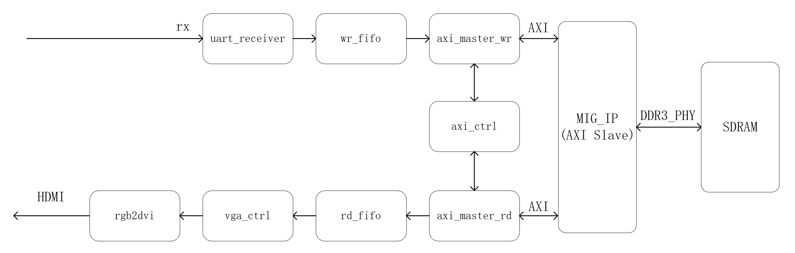

#### 关于

本项目在Xilinx FPGA平台上实现了对DDR3 SDRAM读写操作，通过SD卡接口将先图像数据存到SDRAM存储器，接着读取存储数据内容，并通过HDMI音视频接口实现图像/视频显示，其中DDR3读写控制器是AXI总线接口从机。本仓库的[non_fifo_ip branch](https://github.com/lauchinyuan/FPGA_DDR3_Ctrl/tree/non_fifo_ip)提供了不使用FIFO IP核的实现方案，即利用自行设计的异步FIFO模块，取代FIFO IP核，实测其部署后的资源开销更小。sd卡读取模块使用开源项目，项目链接：https://github.com/WangXuan95/FPGA-SDcard-Reader，目前暂未对其进行更多优化，后续有需要再进行开发。

**若您想复现该工程，请先阅读本文最后一段，有任何问题欢迎您通过lauchinyuan@yeah.net联系我，一起探讨学习。**

FPGA上板实验的效果如图1-3所示，硬件实验平台使用的是博宸精芯Kintex-7基础板开发板，芯片型号为XC7K325T-2FFG676，在其它硬件平台上复现该工程时，应注意更改约束文件中的管脚约束，同时MIG IP核也应该依据所用硬件平台的SDRAM型号进行相应更改。

图1. 演示1

图2. 演示2

图3. 演示3(视频播放)

#### 更新说明

2023/11/23： 更改了MATLAB脚本生成文件的逻辑，将图像/视频像素数据直接以二进制的形式写入txt文本，这一文本文件可以直接通过串口调试助手发送，更实用。

#### 仓库内容简介

本仓库提供了所有模块的[Verilog 代码](./rtl)，其中比较关键的模块是[AXI写主机](./rtl/axi_master_wr.v)、[AXI读主机](./rtl/axi_master_rd.v)、[AXI控制器](./rtl/axi_ctrl.v)，这三个模块加上AXI总线 DDR3 MIG IP核，构成了[DDR3读写接口](./rtl/ddr_interface.v)。

[testbench](./testbench)目录提供了几乎所有子模块的仿真测试文件，[wave](./wave)目录下提供了本工程子模块的简要波形示意图，**配合波形图将有助您理解本工程的设计细节**。

[xci](./xci)目录存放了项目中用到的所有IP核文件配置信息，在Vivado中作为source添加即可，其中rgb2dvi IP核使用[Digilent开源IP核](https://github.com/Digilent/vivado-library/tree/master/ip)，需要在Vivado上添加IP核仓库。

图像数据处理方面， [matlab](./matlab)目录提供了将图像转换为16进制像素值txt文件的MATLAB脚本。而[img](./img)文件夹则是一些测试图像文件，[txt](，/txt)文件夹是转换后的数据文本文件， 可以通过串口直接以文件形式发送或保存到SD卡根目录进行读取。

#### 数据流&框图

本项目的结构示意图如图3(SD卡版本将uart_receiver模块改为sd_file_reader)

图3. 系统框图

处理数据的流程具体说明如下：

1. 将图像数据文本存到sd卡根目录文件中。
2. 像素数据存到"写FIFO"中，进行缓存。
3. "写FIFO"中的数据数量满足设定值，向AXI写主机发送写数据请求。
4. AXI写主机收到写请求，发起AXI总线写动作，将数据发送到AXI从机(DDR3 MIG IP核)。
5. AXI从机将AXI总线上送来的数据转换为DDR3 SDRAM物理接口时序，将数据写入SDRAM中。
6. VGA模块依据VGA时序，在需要输出图像数据时，向"读FIFO"模块发出读请求，并获得“读FIFO”内存储的数据，而当“读FIFO”内数据不够时，向“AXI读主机“发送读请求。收到请求后“AXI读主机“发起AXI读操作，从AXI从机(DDR3 MIG IP核)处获取SDRAM中存储的数据。其中DDR3 MIG IP核将解析AXI总线协议，并转换为DDR3的读时序，从SDRAM读取数据。
7. VGA模块获得数据，并生成VGA时序。
8. 通过rgb2dvi IP核将VGA时序转换为HDMI TMDS时序，通过HDMI接口将图像输出到屏幕上。

#### 复现需注意！

1. 若您想测试通过在线逻辑分析仪(ILA)， 简单分析ddr读写功能，而不进行图像显示，请将[ddr3_test](./rtl/ddr3_test.v)模块置为顶层，并将[ddr3_test.xdc](./constrs/ddr3_test.xdc)设置为target约束文件。否则顶层模块是[uart_ddr_hdmi](./rtl/uart_ddr_hdmi.v)，约束文件为[uart_ddr_hdmi.xdc](./constrs/uart_ddr_hdmi.xdc) 

2. 图像显示使用RGB888格式，为了可以在一个时钟周期内得到一个像素数据，实际上从“读FIFO”中获取的数据位宽为32bit， 数据从高到低分别为R、G、B、0 ，最低位舍去。
3. 为了正确显示图像，[顶层模块](./rtl/ddr3_test.v)中设置的的读写地址空间parameter应该与所显示图像分辨率相匹配，例如显示分辨率为1280*960，则寻址空间范围应该是 1280 × 960 × 4 =  4915200（如2， 每一个像素实际上的存储空间是32bit，即4Byte）。进行视频输出时，寻址范围设置为这个值的帧数倍，例如显示60帧，则上面例子中寻址空间范围为4915200×60。

4. 更改图像分辨率，请在[vga_ctrl](./rtl/vga_ctrl.v)模块更改parameter， 注意要更改时钟生成IP核(clk_gen)的时钟频率(clk_fifo及clk_hdmi)， clk_fifo即vga时序的像素时钟，其中hdmi时钟频率和vga时钟频率要保持5：1的关系，更改频率后，也要注意更改顶层模块定义的FREQ parameter。

有任何问题欢迎联系我(●ˇ∀ˇ●)
